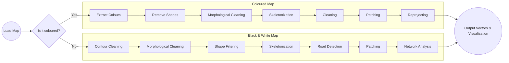

# *des*Cartes

***des*Cartes recognises roads on old maps, and converts them to vector lines that can be used in GIS applications and historical transport network analysis.** *It is currently under development, but you can try a [limited live demo](#live-demo).*

+ [Black & White Maps](#black--white-maps)
+ [Coloured Maps](#coloured-maps)
+ [Flowchart](#flowchart)
+ [Development 'Roadmap'](#development-roadmap)
+ [Live Demo](#live-demo)
+ [Customisation & Funding](#customisation--funding)

---

## Black & White Maps

For any given map [extent](https://en.wikipedia.org/wiki/Map_extent) (bounding coordinates), *des*Cartes first generates a georeferenced map image ([geotiff](https://en.wikipedia.org/wiki/GeoTIFF)), and then - using a range of adjustable input parameters - processes the image to extract candidate road lines.

>
>
>Demonstration of *des*Cartes. The user can select a map area (for the sake of server resources currently limited to a maximum of 10 km² for maps at this scale) and adjust the parameters used to detect likely roads.

>
>
>Output from *des*Cartes. A range of images is presented to indicate the steps taken in identifying likely roads, and a button is provided for the download of vector data.

>
>
>This image shows the tests run along the contours of a skeletonized image to determine the presence or otherwise of road boundaries or modern roads (shown in yellow). Shape filtering before running these tests would eliminate most of the false contours in white areas. The modern road tests check not only the presence of a road in the vicinity, but also its orientation relative to the candidate road. 

>
>
>Network analysis aims to group candidate roads into a likely network, patching gaps where necessary. Candidate roads which fail a connectivity test are eliminated. Parameters for tuning the analysis are yet to be properly determined, and in the meantime results range from terrible to impressively good!

>
>
>Output from *des*Cartes. Areas are shaded by colour to indicate the criteria by which they were rejected as candidate roads. Candidate road vectors are scored based on their adherence to map contours and their similarity to modern roads, and their score is reflected in the opacity of the yellow lines. Blue lines are un-scored gap-fillers.

## Coloured Maps

Extracting road vectors from coloured maps poses a different set of challenges.

>
>
>In this map, the roads of interest are coloured red, brown, and yellow. Complications arise because parts of the roads are obliterated by text and map features, and these colours are also used for things like elevation contours, road numbering, and railway stations.

>
>
>In the demo, an area up to 40 km² can be selected by the user. Results include images showing the colours extracted from the map, an edited, "skeletonized", and vectorised version of the colour map, and another version in which the gaps have been patched.

>
>
>Extracted colours, with configured shapes removed (in this case, the railway station). Road numbering remains, and there are some quite large gaps where roads were obliterated by other features.

>
>
>The coloured shapes are then thinned down to a single-pixel width, and then traced (by processing contours) to produce gappy vector lines.

>
>
>Gaps are closed by a variety of techniques, which include extending each line a pixel at a time to see if it meets another extending line within a given distance, linking unconnected endpoints to nearest lines, and snapping near-coincident endpoints.

## Flowchart

This gives a very broad overview of the sequencing of processes for different types of map. Each process takes a customisable set of parameters which have a significant impact on the quality of results. The sequencing and parameters need to be adjusted depending on the style of the map.

## Development Roadmap

- [ ] Improve 1890s B&W vectorisation by reference to vectorised 1950s coloured map framework ([Issue #11](https://github.com/docuracy/desCartes/issues/11)).
- [ ] Publish code as configurable, executable pipeline components using [Google Colab](https://colab.research.google.com/)-flavoured Jupyter notebooks.
- [ ] Enable upload of georeferenced maps or plain map images in lieu of map tiles ([Issue #12]([../../issues/12](https://github.com/docuracy/desCartes/issues/12))).
- [ ] Refine processing parameters through machine learning ([Issue #4](https://github.com/docuracy/desCartes/issues/4)), using TensorFlow Keras in Colab.
- [ ] Create a national "#GB1900" road vector dataset ([Issue #13](https://github.com/docuracy/desCartes/issues/13)).

## Live Demo

[Click here](https://bit.ly/desCartes-demo) for a limited live demonstration of *des*Cartes in your browser, where you can select a small area on a map and see the results of image processing, and download a GeoPackage of the predicted road network for use in GIS software. Choose from several preconfigured map tilesets, or experiment with your own.

### Map Tile Sources

*des*Cartes might be adapted to suit other maps, but is pre-configured for use with:
+ The [National Library of Scotland](https://maps.nls.uk/os/)'s GB Ordnance Survey map tiles served by [MapTiler Cloud](https://cloud.maptiler.com/tiles/).
  + [Six-Inch to the mile, 1888-1913](https://cloud.maptiler.com/tiles/uk-osgb10k1888/)
  + [One-Inch Seventh Series, 1955-1961](https://cloud.maptiler.com/tiles/uk-osgb63k1955/)
+ A small selection of the [British Library](https://www.bl.uk/collection-guides/ordnance-survey-mapping)'s early 19th-century [GB Ordnance Survey drawings](https://commons.wikimedia.org/wiki/Category:Ordnance_Survey_Drawings).
+ The vectorised modern UK road network from [Ordnance Survey Open Roads](https://www.ordnancesurvey.co.uk/business-government/products/open-map-roads).

---

## Customisation & Funding

You are free to share and adapt this software yourself, subject to proper attribution as detailed in [the license](https://github.com/docuracy/desCartes/blob/main/LICENSE.md), but **commissions for customised development are very welcome!**

**Development and server costs are otherwise entirely self-funded. Please [donate](https://ko-fi.com/docuracy) if you can.**

Follow [@docuracy](https://twitter.com/docuracy) on Twitter or [@stephengadd@mstdn.social](https://mstdn.social/@stephengadd) on Mastodon for updates.
